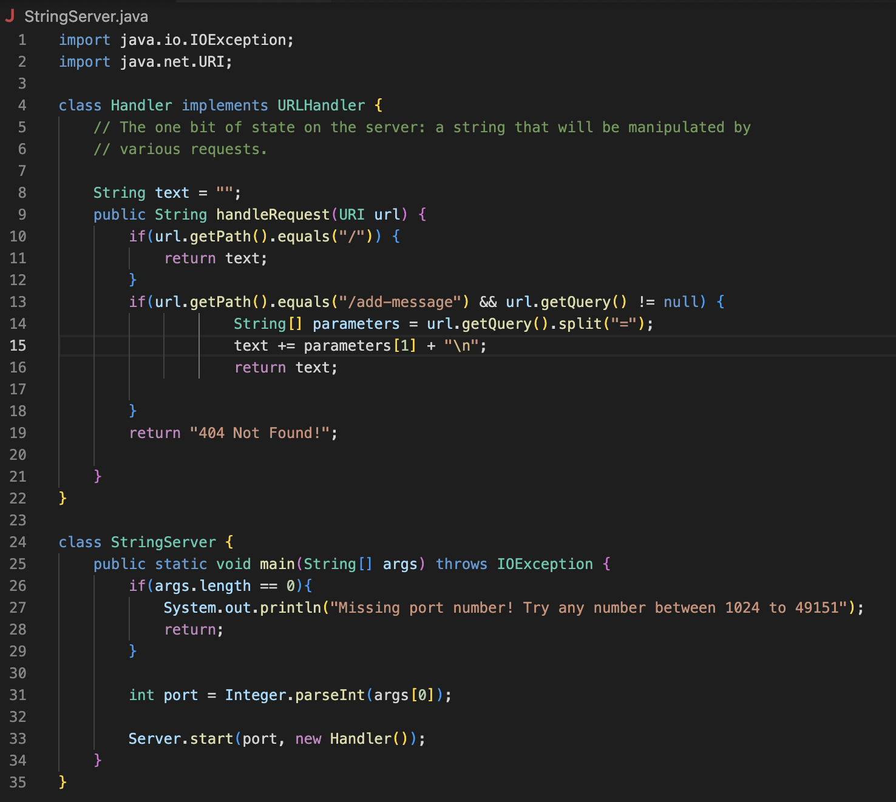
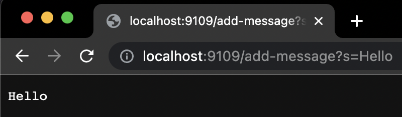
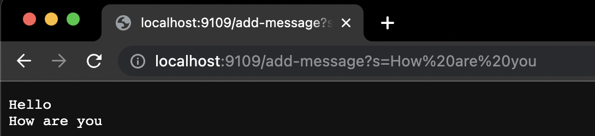
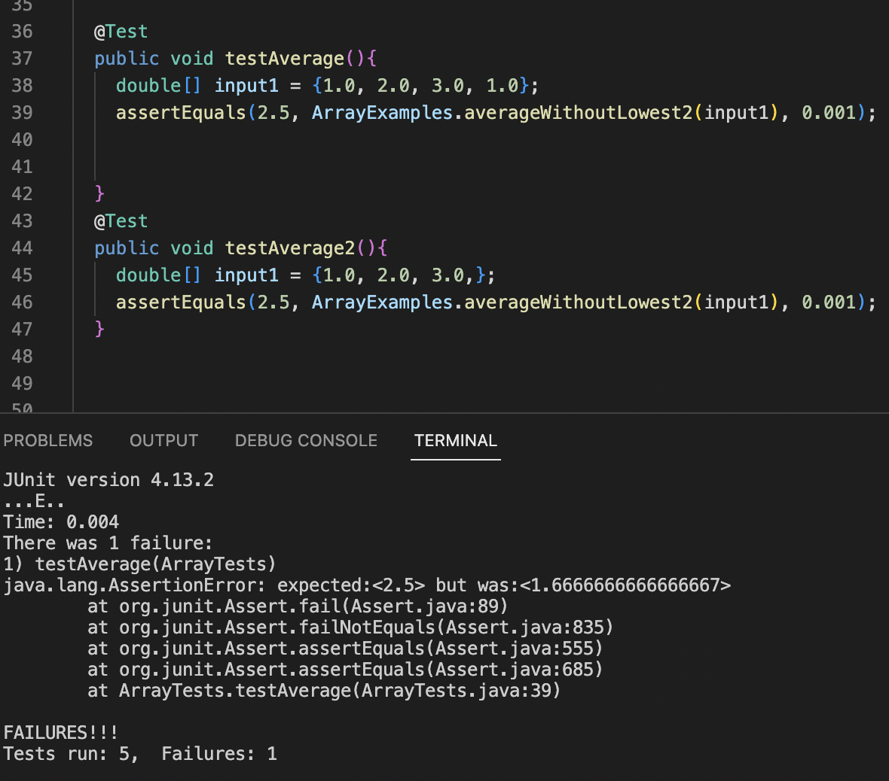

## Part 1: String Server
This is the code that I wrote in order to create my StringServer. The StringServer program creates a server that allows you to add a message to the screen. The code for the program follows:



The program takes a string and adds on to that same string, but every time something is added, it is added onto a new line. When the Server is started with StringServer the `.start` method is called on `Server` which takes a port value and a `new Handler()`. In the cases below the value of `int port` = **9109** since that is the port we chose when we compiled and ran the server. When the server is first started there is a value `new URI(http://localhost:9109)` which is automatically passed into the `handleRequest(URI url)` method. `url` = the new url that we just created previously. The value of `String text` defaults to a value of `""` which is an empty string. 

These are the values when the server is initially started.

Here is an example of adding a message with the program:


When we add "Hello" this program is run with a `url` value of `new URI(http://localhost:9109/add-message?s=Hello` then the values within the method body change. First, the methods `getPath` and `equals` are called on the url which looks like `url.getPath.equals(/add-message)` this gives us the path of the `url` which is `/add-message` and the **.equals** checks if it is equal to "/add-message". In the same line of code(13) we call the `getQuery` method on the same `url` which gives us a value of `?s=Hello`. Then a new string array is created which is `String[] parameters`. The value for this string array will be obtained from the following method call on the url value: `url.getQuery().split("=")`.
This will give the `parameters` string array a value of `{"?s", "Hello"}`. This will then give a value to `text` which is going to be `text + parameters[1] + "\n"`. The `text` value is set by giving the original `text` value which at this point is `""` + `parameters[1]` which is `Hello` in this case and then it also adds a new line by doing `+ "\n"`. At the end of this request `text` is equal to:
```
Hello
                       // this is an empty line
```

When we add "How Are You" this program is run with a `url` value of `new URI(http://localhost:9109/add-message?s=How are you` then the values within the method body change once again. First, the methods `getPath` and `equals` are called on the url which lookes like `url.getPath.equals(/add-message)` this gives us the path of the `url` which is `/add-message` and the **.equals** checks if it is equal to "/add-message". In ht esame line of code(13) we call the `getQuery` method on the same `url` which gives us a value of `?s=How Are You`. Then a new string array is created which is `String[] parameters`. The value for this string array will be obtained from the following method call on the url value:
`url.getQuery().split("=")`
This will give the `parameters` string array a value of `{"?s", "How are you"}`. This will then give a value to `text` which is going to be `text + parameters[1] + "\n"`. The `text` value is set by giving the origial `text` value which at this point is `"Hello"`, due to the previous handle request, + `parameters[1]` which is "How are you" + `"\n"` which is a new line. At the end of this request `text` is equal to:
```
Hello
How are you
                    // this is an empty line
```

## Part 2: Choosing A Bug From Lab 3
The buggy program that I will be using is the `averageWithoutLowest` method. The buggy version of this program looks like this:
```
  static double averageWithoutLowest(double[] arr) {
    if(arr.length < 2) { return 0.0; }
    double lowest = arr[0];
    for(double num: arr) {
      if(num < lowest) { lowest = num; }
    }
    double sum = 0;
    for(double num: arr) {
      if(num != lowest) { sum += num; }
    }
    return sum / (arr.length - 1);
  }
  
  ```
  This program is supposed to take the mean of the numbers(doubles) within the array. However, it is supposed to take the mean without including the lowest
  number within the array. The program should also return 0 if there are no elements in the array or if there is only 1 element in the array. However the bug
  within this program is that it doesn't account for the possiblity of there being duplicates of the lowest number within the array. The program does 
  `return sum / (arr.ength - 1);` but it should do `return sum / (arr.length - #the amount of the lowest number in the array)`.
  
  Due to the nature of this buggy program, if we have a duplicate `lowest` within the array it will fail to do the task correctly. An example of a
  failure-inducing test would be:
  ```
  @Test 
  public void testAverage(){
    double[] input1 = {1.0, 2.0, 3.0, 1.0};
    assertEquals(2.5, ArrayExamples.averageWithoutLowest(input1), 0.001);

    
  }
  
  ```
  This test makes the program fail because it has duplicate `lowest` numbers, which are equal to 1.0. The program fails to return the correct mean of the
  array because when it does the calculation `return sum / (arr.length - 1);` it only accounts for one of the `lowest` numbers within the array instead of both.
  This results in the calculation being `5 / (4 - 1)` which = `5 / 3` = `1.666666666667`.
  
  The program works fine when there is only one `lowest` number within the array. An example of a test that does not induce a failure would be:
  ```
    @Test
  public void testAverage2(){
    double[] input1 = {1.0, 2.0, 3.0};
    assertEquals(2.5, ArrayExamples.averageWithoutLowest2(input1), 0.001);
  }
  ```
  The test passes with the buggy program because there is only one of the `lowest` numbers within the array which is `1`. Since there is only one of the `lowest` values in the array the calculation would be `5 / (3 - 1)` whihch = `5 / 2` = `2.5`. This is the correct average without the lowest value in the array. It is correct because in this case, since there is only one `lowest` value then the `- 1` in the calculation is correct because there is only one `lowest` value within the array.
  
 ### Picture of Symptoms with Both Tests
 
 
 ### Before and After Fixing Code
 Before(Buggy Program):
 ```
   static double averageWithoutLowest(double[] arr) {
    if(arr.length < 2) { return 0.0; }
    double lowest = arr[0];
    for(double num: arr) {
      if(num < lowest) { lowest = num; }
    }
    double sum = 0;
    for(double num: arr) {
      if(num != lowest) { sum += num; }
    }
    return sum / (arr.length - 1);
  }
  ```
  After(Fixed Program):
  ```
    static double averageWithoutLowest(double[] arr) {
    if(arr.length < 2) { return 0.0; }
    double lowest = arr[0];
    int lowestCounter = 0;
    for(double num: arr) {
      if(num < lowest) { lowest = num; }
    }
    for(double num: arr){ // Added this for loop to count the amount of `lowest`.
      if(num == lowest){  // This allows us to calculate the mean excluding every 'lowest' value within the array.
        lowestCounter += 1;
      }
    }
    double sum = 0;
    for(double num: arr) {
      if(num != lowest) { sum += num; }
    }
    return sum / (arr.length - lowestCounter);
  }
  ```
  The fix for the program was to account for the amount of `lowest` values within the array and not just one. In order to do this we added a for loop that counts the amount of `lowest` values within the array and sets `lowestCounter` to that amount. After this for loop runs, we then know how many `lowest` values are in the array. This also allows us to fix the calculation that is being returned. Instead of `return sum / (arr.length - 1);` we change it to
  `return sum / (arr.length - lowestCounter);` which will give us `sum / amount of numbers in the array without any of the lowest values` this will allow us to get the correct mean for the array without the lowest values. For example the test with the fixed program:
  ```
    @Test 
  public void testAverage(){
    double[] input1 = {1.0, 2.0, 3.0, 1.0};
    assertEquals(2.5, ArrayExamples.averageWithoutLowest(input1), 0.001);
  }
  ```
  This test will give set `lowestCounter` to 2 since there are two of the `lowest` values which are `1.0`. It then gives us the calculation
  `return 5.0 / 2;`. This because `3.0 + 2.0 = 5.0` and `4 - 2 = 2`. In this previous calcualation **4** is the array length and the first **2** is the value of `lowestCounter`, the amount of the `lowest` values in the array.
 
## Part 3: Something I Learned
One thing that I learned in this lab is how to write JUnit tests for Arrays and doubles. Previously I didn't know how to write JUnit tests for methods that returned arrays but now I do which is something like this `assertArrayEquals(new int[]{1, 2, 3}, ArrayExamples.reversed(input2));`. Before I only knew how to write JUnit tests for methods that returned integers. Same thing goes for writing JUnit tests for methods that returned doubles. I now know that they look something like this `assertEquals(2.5, ArrayExamples.averageWithoutLowest(input1), 0.001);`. Before I knew this I tried simply writing it like an integer JUnit test, but I failed to realize that for doubles you have to include `0.001` at the end like in the example above.
 
  
